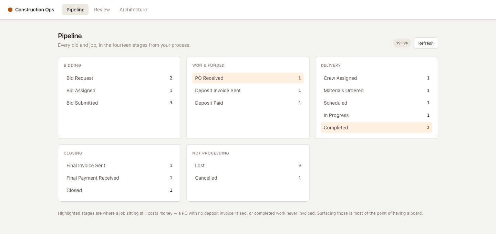
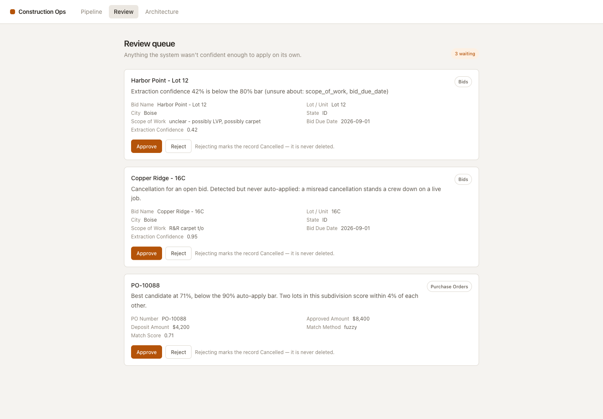
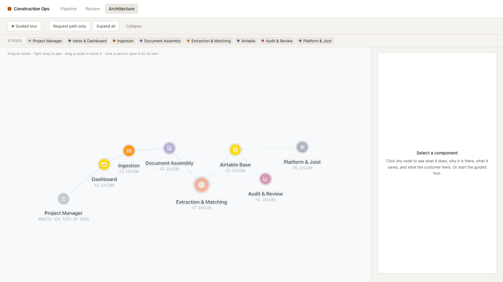
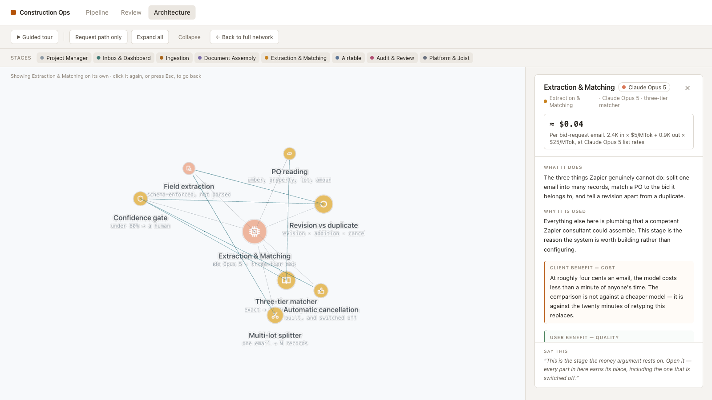
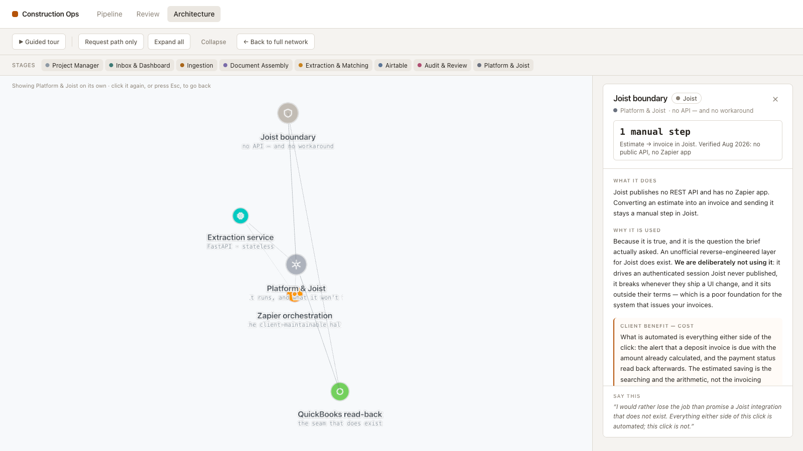

# Airtable + AI Construction Operations System

A working reference implementation for a general contractor's bid-to-payment
pipeline: AI reads bid-request emails and purchase orders, writes structured
records into Airtable, and refuses to guess when it is unsure.

Plus an interactive 3D architecture explorer that explains the design — and
what it deliberately does not do — to a non-technical buyer.

```
Gmail ──Zapier──▶ FastAPI ──▶ Claude Opus 5 extraction
                     │              │
                     ├── fingerprint + dedup
                     ├── three-tier PO matching
                     └── revision vs duplicate
                     ▼
                Airtable ◀── Next.js dashboard + review queue
                     │
              QuickBooks Online ◀─native sync─ Joist (manual step, by design)
```

---

## The dashboard

Every bid and job in the fourteen stages the client described, taken from their
own brief rather than a generic CRM template. The highlighted stages are where
a job sitting still costs money — a PO with no deposit invoice raised, or
completed work never invoiced.



Everything the system declined to do on its own lands in one queue, next to the
reason it hesitated. This screen is what makes conservative thresholds
affordable: being unsure costs one click, where being confidently wrong costs a
duplicate job nobody finds for three weeks.



The three items are the three kinds of doubt the system can have — a
low-confidence extraction, a cancellation it detected but will not auto-apply,
and a PO match at 71% where two lots in one subdivision scored within 4% of
each other.

---

## The architecture explorer

A pipeline you fly through rather than a picture you paste into a slide. Eight
stages in the order a bid request actually travels; clicking one isolates it
and opens its parts.



Every component answers four questions in plain language — what it does, what
breaks without it, what it saves the buyer, and what the user feels — plus one
hard number. Clicking the extraction stage isolates it and shows the seven
parts the commercial argument rests on:



The metric tile is the pitch: **≈ $0.04 per bid-request email**, with the
arithmetic shown so it can be checked (`2.4K in × $5/MTok + 0.9K out ×
$25/MTok`, at Claude Opus 5 list rates). Note the last part in that cluster —
*Automatic cancellation: built, and switched off*.

And the card that answers the question the brief actually asked:



Joist publishes no REST API and has no Zapier app. An unofficial
reverse-engineered layer exists and is deliberately not used. What is automated
is everything either side of the click, with payment status read back through
the seam that does exist — QuickBooks Online, which Joist syncs to natively.

A 24-stop guided tour walks this whole argument in order, and runs **with the
backend stopped** — the data is static precisely so a live demo cannot fail
because a service is cold.

## What it actually does

- **One email → many records.** A bid request covering six lots becomes six
  independent jobs, each with its own address, scope and due date.
- **POs match existing bids.** Three tiers — exact key, fuzzy, then the model
  only for genuine ambiguity — so most POs resolve at zero marginal cost. The
  50% deposit is computed on arrival.
- **Revisions never duplicate, cancellations never delete.** A fingerprint of
  property and lot survives a scope change, so a revision updates the same job.
  Previous values are written to the audit log *before* the update lands.
- **Uncertainty is routed, not swallowed.** Below the confidence threshold,
  against a job that already has money attached, or on any cancellation,
  nothing auto-applies — it goes to a review queue.
- **Everything is logged with its cost**, so the per-email figure quoted in the
  architecture explorer is checkable rather than promotional.

## Quick start

Neither the tests nor the architecture page need any credentials.

```bash
# Backend — 76 tests, fully offline
cd backend
python3 -m venv .venv && .venv/bin/pip install -e ".[dev]"
.venv/bin/python -m pytest

# Frontend — architecture data integrity, then the app
cd ../frontend
npm install
npm test
npm run dev          # http://localhost:3000/architecture
```

### Demo mode — the dashboard, without credentials

`DEMO_MODE=true` serves an in-memory base seeded with a plausible week of work
instead of talking to Airtable. It is the same repository implementation the
test suite drives, so what is demonstrated is the code path that is tested
rather than a mock that has drifted. This is how the screenshots above were
taken, and it is the way to screen-record the dashboard before a client has
handed over any keys.

```bash
cd backend
DEMO_MODE=true .venv/bin/python -m uvicorn app.main:app --port 8000
```

`/health` reports `demo_mode`, so a service accidentally left in this state is
visible rather than silently serving fiction.

To run it for real, copy `.env.example` to `backend/.env` and fill in an
Anthropic key and an Airtable PAT, then:

```bash
cd backend
.venv/bin/python scripts/provision_airtable.py     # creates the 9 tables
.venv/bin/python -m uvicorn app.main:app --reload

# demo: one email becomes six records
.venv/bin/python scripts/send_fixture.py multi_lot_bid_request.json
# run it again — nothing is created, and no model call is made
.venv/bin/python scripts/send_fixture.py multi_lot_bid_request.json
```

## Layout

| Path | What's in it |
|---|---|
| `backend/app/extraction/` | Claude Opus 5 structured extraction — schemas, prompts, PDF handling |
| `backend/app/matching/` | Fingerprinting, the three-tier PO matcher, revision classification |
| `backend/app/airtable/` | Schema as code, Meta-API provisioning, data access |
| `backend/app/pipeline.py` | The 14 stages — one source of truth for schema, logic and UI |
| `backend/app/demo.py` | In-memory repository + seed data, shared by the tests and `DEMO_MODE` |
| `frontend/lib/architecture-data.ts` | The architecture explorer's content |
| `zapier/README.md` | Zap-by-zap build guide, including the HMAC signing step |
| `docs/joist-assessment.md` | What can and cannot be automated with Joist, with sources |
| `docs/airtable-schema.md` | Generated from the schema; regenerate with `--emit-doc` |

## Things worth knowing before changing anything

- **`pipeline.py` is the single source of truth for the 14 stages.** The
  Airtable single-select, the "is this job committed" logic and the dashboard
  board all derive from it. Editing the stage list in one place only is how
  they drift.
- **The idempotency check runs before the model call, not after.** A Zapier
  retry storm is therefore free as well as harmless. Moving it costs money.
- **Nothing deletes a bid record.** Not the cancellation path, not review
  rejection. If you add a delete, you have broken the guarantee the whole
  revision design rests on.
- **`ENABLE_AUTO_CANCELLATION` defaults to false on purpose**, and never
  applies to a job with a PO attached regardless. See the `auto-cancel` node in
  the architecture explorer for the reasoning.
- **The architecture page must render with the backend stopped.** It is shown
  live to people making buying decisions. Keep its data static.
